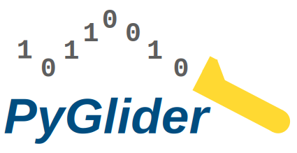

pyglider
========

Python tools for interacting with ocean glider data

Installation:
=============

- install conda/miniconda
- clone the repository onto your computer and cd into the directory
- from inside the cloned repository directory run
`conda env create -f environment.yml`, it will read environment.yml and
automatically install the dependencies, and create environment `pyglider`,
(though you can change the name by editing `environment.yml`)

Editable installation
=====================

If you want to be able to edit the files in `pyglider/pyglider` then install
as above, and then do `pip install -e .`.  That will re-install pyglider
with links to the local directory, so you can edit the library files.
If you do so consider making a pull-request with your changes!

Getting Started
===============

The work flow (for now) for a new deployment data set from a Slocum glider is

1. offload the data from the glider computer or get from the dockserver
2. copy data from `offload/Science/SENTLOGS/*.EBD`,
  `offload/Science/LOGS/*.EBD`, `offload/Main_board/LOGS/*.DBD`, to `./binary/` of your new deployment
  presumably in a different directory than `example`
3. copy the data from the caches to `yourdeployment/cac/`; these are
  found in `offload/Science/STATE/CACHE/*.CAC` and
  `offload/Main_board/STATE/CACHE/*.CAC`.
4. Edit `rosie_713_sensors.txt` (and probably name after your own glider)
  for the data streams from the raw files you want.  The name of all the
  variables are in the `*.CAC` files.
5. Edit `deployment.yaml` with appropriate metadata for your glider and
  deployment.  There are a lot of fields, but most should not change after
  the first deployment unless the sensor payload changes on the glider.

Why?
====

There are other glider workflows, but the only ones I know of are in Matlab,
and there is no reason for that.

The only disadvantage of this code is that the dcoding step from binary to
the raw netcdf is quite slow for the Slocum binary data.  That can/should
be improved by using a C library instead of python, but really, its not *that*
slow.

Resources
=========

- Slocum binary translator based on
https://gitlab.oceantrack.org/ocean-gliders-canada/dinkum/tree/seabBranch_py3
- Processing steps closly follow the work by SOCIB
https://github.com/socib/glider_toolbox
- Rutger's description of the binary files is very helpful: https://github.com/kerfoot/spt/wiki/Slocum-Glider-Data-File-Primer
- The somewhat arcane metadata format for NGDAC is here: https://github.com/ioos/ioosngdac/wiki/NGDAC-NetCDF-File-Format-Version-2
